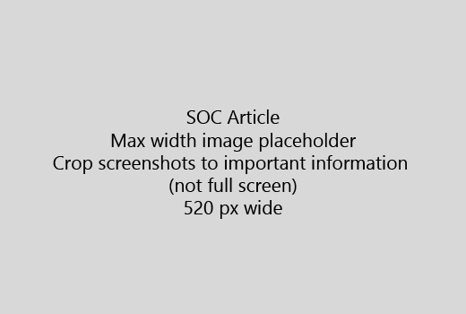

Ξεκινήστε το άρθρο σας με μια πολύ μικρή Εισαγωγή (1 πρόταση). Τοποθετήστε τον εαυτό σας στη θέση του αναγνώστη - γιατί είναι εδώ; Τι πρέπει να κάνουν;Start your article with a very short introduction (1 sentence). Put yourself in the reader's place - why are they here? What should they do? 
  
1. Λάβετε απευθείας στη μια γρήγορη λίστα των βημάτων για να ολοκληρώσετε την εργασία.Get straight to a quick list of steps to accomplish the task.
    
    Εάν πρέπει να εξηγούν μια έννοια ή θα πρέπει να γίνει εκ των προτέρων τα αναγκαία βήματα, προσθέστε μια γρήγορη Σύνοψη κάτω από τη βαθμίδα, όπου χρειάζεται, και [σύνδεση](https://support.office.com/article/f37e7984-cf03-4fde-92d3-82970d7e241b.aspx) με την έννοια ή τα βήματα.If you need to explain a concept, or they have to do pre-requisite steps, add a quick summary below the step where they need it, and [link](https://support.office.com/article/f37e7984-cf03-4fde-92d3-82970d7e241b.aspx) to the concept or steps. 
    
2. Διατήρηση διαδικασιών σύντομη - κατά προτίμηση 5 ή λιγότερα βήματα, όχι περισσότερο από 8.Keep procedures short - preferably 5 or fewer steps, no more than 8.
    
3. Χρησιμοποιήστε **στυλ περιβάλλοντος εργασίας χρήστη** για στοιχεία του περιβάλλοντος εργασίας χρήστη ή για κείμενο άτομα χρειάζεται να εισαγάγουν.Use **Ui style** for user interface elements or for text people need to enter. 
    
4. Χρησιμοποιήστε τα ρήματα επιλέξτε, επιλέξτε, ή εισαγάγετε ως δράσεις και μορφοποίηση μενού ως **μενού** \> **εντολή**.Use the verbs choose, select, or enter as actions, and format menus as **Menu** \> **Command**.
    
5. Προαιρετικά, προσθέστε ένα στιγμιότυπο οθόνης για το περιβάλλον (Εάν το περιβάλλον εργασίας Χρήστη είναι δύσκολο να εντοπίσετε ή απαιτείται για την ολοκλήρωση της εργασίας).Optionally, add a screenshot for context (if UI is hard to locate, or it's needed to complete the task).
    
    Μέγιστο πλάτος: 520 pixels. Χρησιμοποιήστε ένα τυπικό θέμα, να μην εμφανίζεται προσωπικές πληροφορίες, και περικοπή για να εμφανίσετε μόνο τι είναι σχετική.Maximum width: 520 pixels. Use a standard theme, do not show any personal information, and crop to show only what's relevant. 
    
    
  
Εάν θέλετε να προσθέσετε ένα βίντεο ή ένα στιγμιότυπο οθόνης, να χρησιμοποιήσετε ένα πλέγμα δύο στηλών και να έχουν τα βήματα στα αριστερά και το βίντεο ή το στιγμιότυπο οθόνης στην δεξιά - δείτε [βήματα και παράδειγμα βίντεο πλέγματος](https://support.office.com/article/14ce8e82-efa0-47f5-bb84-94f078db3dae.aspx).If you want to add a video or screenshot, use a two-column grid and have the steps in the left and the video or screenshot in the right - see [Steps and video grid example](https://support.office.com/article/14ce8e82-efa0-47f5-bb84-94f078db3dae.aspx). 
  
Στοχεύστε 500 λέξεις για ένα άρθρο.Target no more than 500 words for an article.
  
# Παράδειγμα άρθρουExample article

[Αλλαγή μου φωτογραφιώνChange my photo](https://support.office.com/article/555376e0-1fca-49ba-8434-307a0525c767.aspx)
  

