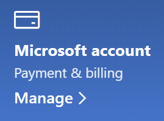

# Αλλαγή των πληροφοριών του λογαριασμού Microsoft

Μεταβείτε [https://account.microsoft.com](https://account.microsoft.com/) και πραγματοποιήστε είσοδο, εάν είναι απαραίτητο. Αυτό θα σας πάει στον πίνακα εργαλείων του λογαριασμού σας.  

**Επεξεργασία του ονόματος και των προσωπικών πληροφοριών μου**

1. Στον πίνακα εργαλείων του λογαριασμού σας, δίπλα στην εικόνα και το όνομα του λογαριασμού σας, κάντε κλικ στις τρεις τελείες (περισσότερες ενέργειες) > επεξεργασία προφίλ**.
2. Στη σελίδα **"Επεξεργασία προφίλ",** χρησιμοποιήστε τις συνδέσεις που παρέχονται για να αλλάξετε την εικόνα προφίλ, το όνομα, την ημερομηνία γέννησης, την τοποθεσία και την προτίμηση γλώσσας εμφάνισης. Σημειώστε τις συνδέσεις προς τα προφίλ του λογαριασμού Xbox ή Skype, όπου μπορείτε να αλλάξετε λεπτομέρειες ειδικά για αυτούς τους λογαριασμούς.

**Διαχείριση διευθύνσεων ηλεκτρονικού ταχυδρομείου και αριθμών τηλεφώνου**

Ένας λογαριασμός Microsoft έχει μία ή περισσότερες διευθύνσεις ηλεκτρονικού ταχυδρομείου ή αριθμούς τηλεφώνου που σχετίζονται με αυτόν ως "ψευδώνυμα". Για να διαχειριστείτε τα εξής:

1. Στον πίνακα εργαλείων του λογαριασμού σας, δίπλα στην εικόνα και το όνομα του λογαριασμού σας, κάντε κλικ στις τρεις τελείες (περισσότερες ενέργειες) > **επεξεργασία προφίλ.**
2. Στη σελίδα **"Επεξεργασία προφίλ",** κάντε κλικ **στην επιλογή "Διαχείριση του πώς μπορείτε να εισέλθετε στη Microsoft".** 
3. Θα δείτε μια λίστα με ψευδώνυμα λογαριασμού και μπορείτε να διαχειριστείτε τη λίστα, συμπεριλαμβανομένης της προσθήκης και διαγραφής διευθύνσεων ηλεκτρονικού ταχυδρομείου και αριθμών τηλεφώνου. Εδώ μπορείτε επίσης να επιλέξετε ποια ψευδώνυμα μπορούν να χρησιμοποιηθούν για είσοδο στο λογαριασμό και ποιο ψευδώνυμο θεωρείται "κύριο", το οποίο θα εμφανίζεται στις συσκευές Windows 10 σας.

**Διαχείριση μεθόδων πληρωμής, καθώς και όνομα και διεύθυνση χρέωσης** 

1. Στον πίνακα εργαλείων του λογαριασμού σας, δίπλα στην εικόνα και το όνομα του λογαριασμού σας, κάντε κλικ στις τρεις τελείες (περισσότερες ενέργειες) > **επεξεργασία προφίλ.**
2. Στην **περιοχή "Πληρωμή & χρέωσης" κάντε κλικ στην** επιλογή **"Διαχείριση".**

    

3. Εδώ μπορείτε να προσθέσετε, να επεξεργαστείτε και να καταργήσετε μεθόδους πληρωμής και τις σχετικές διευθύνσεις χρέωσής τους. 
