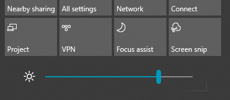

# Αλλαγή φωτεινότητας οθόνης στα Windows 10

Εάν τα Windows 10 είναι νεότερα από την έκδοση 1903, διαθέτει **ρυθμιστικό φωτεινότητας** στο κέντρο ενεργειών. Για να ανοίξετε το κέντρο ενεργειών, κάντε κλικ στο κουμπί **Ειδοποίηση** τέρμα δεξιά στη γραμμή εργασιών ή πατήστε το συνδυασμό πλήκτρων **Windows Home + A** στο πληκτρολόγιό σας.

Εάν τα Windows 10 είναι νεότερης έκδοσης, μπορείτε να βρείτε το ρυθμιστικό φωτεινότητας, μέσω της επιλογής **[Ρυθμίσεις > Σύστημα > Οθόνη](ms-settings:display?activationSource=GetHelp)**.

**Σημειώσεις**:

- Ενδέχεται να μην βλέπετε την επιλογή "Αλλαγή φωτεινότητας" για το ρυθμιστικό ενσωματωμένης οθόνης σε επιτραπέζιους υπολογιστές που έχουν εξωτερική οθόνη. Για να αλλάξετε τη φωτεινότητα μιας εξωτερικής οθόνης, χρησιμοποιήστε τα στοιχεία ελέγχου στην οθόνη.
- Εάν δεν έχετε επιτραπέζιο υπολογιστή και το ρυθμιστικό δεν εμφανίζεται ή δεν λειτουργεί, προσπαθήστε να ενημερώσετε το πρόγραμμα οδήγησης οθόνης. Στο πλαίσιο αναζήτησης στη γραμμή εργασιών, πληκτρολογήστε **Διαχείριση συσκευών** και, στη συνέχεια, επιλέξτε **Διαχείριση συσκευών** από τη λίστα των αποτελεσμάτων. Στη **Διαχείριση συσκευών**, επιλέξτε **Προσαρμογείς οθόνης** και, στη συνέχεια, επιλέξτε τον προσαρμογέα οθόνης. Πατήστε παρατεταμένα (ή κάντε δεξί κλικ) στο εμφανιζόμενο όνομα προσαρμογέα και κάντε κλικ στην επιλογή **Ενημέρωση προγράμματος οδήγησης**. Στη συνέχεια, ακολουθήστε τις οδηγίες.
