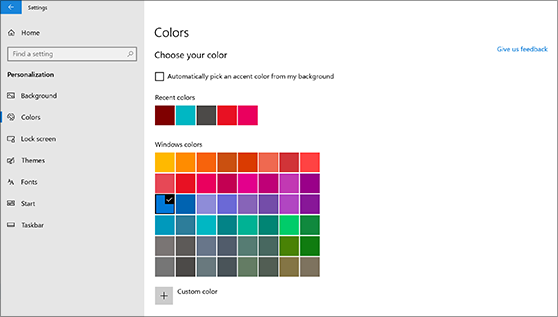

# Αλλαγή του φόντου και των χρωμάτων της επιφάνειας εργασίαςChange your desktop background and colors

Για να αλλάξετε τη ρύθμιση χρωμάτων, μεταβείτε στην ενότητα **Έναρξη**  >  **Settings**  >  **χρωμάτων εξατομίκευσης**ρυθμίσεων  >  **Colors**και, στη συνέχεια, επιλέξτε το δικό σας χρώμα ή αφήστε τα Windows να τραβήξουν ένα χρώμα έμφασης από το φόντο σας.To change your colors setting, go to **Start** > **Settings** > **Personalization** > **Colors**, and then choose your own color or let Windows pull an accent color from your background.

Για να αλλάξετε το φόντο της επιφάνειας εργασίας σας, μεταβείτε στην ενότητα **Έναρξη**  >  **Settings**  >  **προσαρμογής**  >  **φόντου**ρυθμίσεων και, στη συνέχεια, επιλέξτε μια εικόνα, ένα συμπαγές χρώμα ή δημιουργήστε μια παρουσίαση εικόνων.To change your desktop background, go to **Start** > **Settings** > **Personalization** > **Background**, and then choose a picture, solid color, or create a slideshow of pictures. 

Θέλετε περισσότερα φόντα και χρώματα επιφάνειας εργασίας;Want more desktop backgrounds and colors? Επισκεφθείτε το [Microsoft Store](https://www.microsoft.com/store/collections/windowsthemes) για να επιλέξετε ανάμεσα σε δεκάδες δωρεάν θέματα.Visit [Microsoft Store](https://www.microsoft.com/store/collections/windowsthemes) to choose from dozens of free themes.
