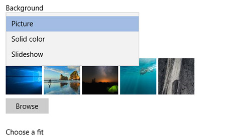

# Αλλαγή φόντου και χρωμάτων της επιφάνειας εργασίας

Για να αλλάξετε τη ρύθμιση χρωμάτων, μεταβείτε στην "Έναρξη" Ρυθμίσεις "Χρώματα εξατομίκευσης" και, στη συνέχεια, επιλέξτε το δικό σας χρώμα ή αφήστε το Windows να τραβήξει ένα χρώμα  >    >    >  έμφασης από το φόντο σας.

Για να αλλάξετε το φόντο της επιφάνειας εργασίας σας, μεταβείτε στην "Έναρξη" Ρυθμίσεις "Φόντο εξατομίκευσης" και, στη συνέχεια, επιλέξτε μια εικόνα, ένα συμπαγές χρώμα ή δημιουργήστε  >    >    >  μια παρουσίαση εικόνων. 

Θέλετε περισσότερα φόντα και χρώματα επιφάνειας εργασίας; Επισκεφθείτε [Microsoft Store για](https://www.microsoft.com/store/collections/windowsthemes) να επιλέξετε από δεκάδες δωρεάν θέματα.
