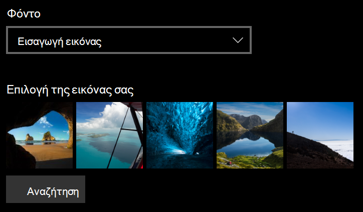
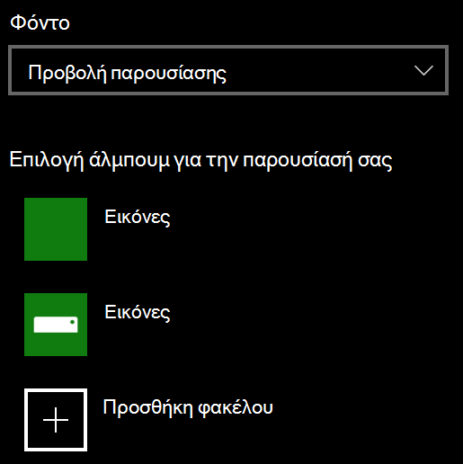

# Αλλαγή του φόντου της οθόνης κλειδώματος

- Μεταβείτε στην οθόνη **Ρυθμίσεις**  >  **κλειδώματος εξατομίκευσης**  >  **Lock screen**. Ή κάντε κλικ ή πατήστε [εδώ](ms-settings:lockscreen?activationSource=GetHelp).

- Για να ορίσετε μια προσαρμοσμένη εικόνα φόντου, επιλέξτε **εικόνα** από την αναπτυσσόμενη λίστα **φόντο** και επιλέξτε ή **Αναζητήστε** την εικόνα.

  

- Για να ρυθμίσετε ένα slideshow με προσαρμοσμένες εικόνες, επιλέξτε **slideshow** από την αναπτυσσόμενη λίστα **φόντου** και επιλέξτε ένα άλμπουμ ή προσθέστε ένα φάκελο που περιέχει τις εικόνες για την παρουσίαση.

  
