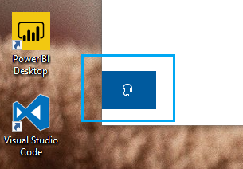

# Επικοινωνήστε μαζί μας κάνοντας κλικ στο κουμπί ακουστικώνContact us by clicking the headphone button

Αν θέλετε να επικοινωνήσετε με την Υποστήριξη της Microsoft, κάντε κλικ στην επιλογή **Επικοινωνήστε μαζί μας** στην κάτω αριστερή γωνία αυτής της εφαρμογής.If you'd like to contact Microsoft Support, please click **Contact us** in the lower left corner of this app. Μέσα στο παράθυρο fly-out, θα οδηγηθείτε στο σωστό κανάλι υποστήριξης μετά την επιλογή του προϊόντος σας και την κατηγορία θεμάτων.Inside the fly-out window, you will be guided to the right support channel after choosing your product and issue category.

Μπορείτε να συνεχίσετε να αλληλεπιδράτε με την υπόλοιπη εφαρμογή ακόμα και μετά την έναρξη μιας περιόδου λειτουργίας Επικοινωνίας.You can keep interacting with the rest of the app even after you have initiated a Contact us session. Ο πίνακας Επικοινωνία ς μπορεί να ελαχιστοποιηθεί προσωρινά κάνοντας κλικ οπουδήποτε αλλού μέσα στην εφαρμογή.The Contact us panel can be temporarily minimized by clicking anywhere else inside the app. Για να επιστρέψετε στην ίδια συνεδρία, απλά κάντε κλικ στην επιλογή **Επικοινωνήστε ξανά μαζί μας.**To return to the same session, just click **Contact us** again.
