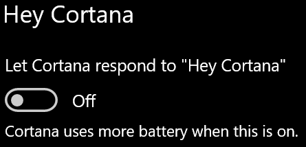

# Η Cortana δεν μου μιλάει ή δεν μπορεί να με ακούσει

Εάν προσπαθείτε να χρησιμοποιήσετε τη δυνατότητα "Hey Cortana", η οποία σας επιτρέπει να μιλάτε στην Cortana χωρίς να επιλέξετε το κουμπί της Cortana στη γραμμή εργασιών ή το κουμπί μικροφώνου στον πίνακα της Cortana, επιβεβαιώστε ότι η δυνατότητα είναι ενεργοποιημένη:

1. Μεταβείτε στην **Έναρξη και,** στη **[συνέχεια, επιλέξτε "Ρυθμίσεις > Cortana".](ms-settings:cortana?activationSource=GetHelp)**
2. Στην **περιοχή Hey Cortana,** αλλάξτε το κουμπί εναλλαγής "Να μπορεί η Cortana να αποκρίνεται **σε "Hey Cortana"** σε **"Ενεργοποίηση".**

**Οι ρυθμίσεις προστασίας προσωπικών δεδομένων εμποδίζουν την Cortana να σας ακούσει;**

Οι ρυθμίσεις προστασίας προσωπικών δεδομένων σας μπορούν να εμποδίσουν την Cortana να απαντήσει στη φωνή σας.
- Ελέγξτε για να βεβαιωθείτε ότι η αναγνώριση ομιλίας στο Internet είναι ενεργοποιημένη:
    - Μεταβείτε στην **Έναρξη και,** στη συνέχεια, κάντε κλικ **[στην επιλογή "Ρυθμίσεις" > "Προστασία προσωπικών > ομιλίας".](ms-settings:privacy-speech?activationSource=GetHelp)**
    - Στην **περιοχή Αναγνώριση ομιλίας στο Internet,** αλλάξτε τη ρύθμιση σε **"Ενεργοποίηση".**
- Ελέγξτε για να βεβαιωθείτε ότι η Cortana έχει δικαιώματα πρόσβασης στο μικρόφωνό σας. 
    - Μεταβείτε στην Έναρξη και, στη συνέχεια, **[κάντε κλικ στην επιλογή "Ρυθμίσεις" > "Προστασία προσωπικών > μικρόφωνο".](ms-settings:privacy-microphone?activationSource=GetHelp)**
    - Στην **περιοχή Επιλέξτε ποιες εφαρμογές θα έχουν** πρόσβαση στο μικρόφωνό σας, αναζητήστε την **Cortana** στη λίστα εφαρμογών και υπηρεσιών και βεβαιωθείτε ότι ο διακόπτης είναι σε ενεργοποίηση. 

Επιπλέον, βεβαιωθείτε επίσης ότι τα ηχεία ή τα μικρόφωνά σας λειτουργούν και λειτουργούν για να μιλήσετε με την Cortana.
