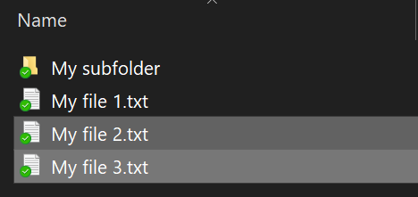
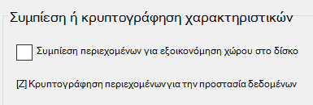

# Κρυπτογράφηση αρχείων ή φακέλων σε Windows 10

Μπορείτε να κρυπτογραφήσετε έναν ολόκληρο δίσκο χρησιμοποιώντας το BitLocker, αλλά για να κρυπτογραφήσετε μόνο μεμονωμένα αρχεία ή φακέλους (και τα περιεχόμενά τους):

1. Στην **Εξερεύνηση αρχείων,** επιλέξτε τα αρχεία/τους φακέλους που θέλετε να κρυπτογραφήσετε. Σε αυτό το παράδειγμα, έχουν επιλεγεί δύο αρχεία:

    

2. Κάντε δεξί κλικ στα επιλεγμένα αρχεία και κάντε κλικ στην επιλογή **"Ιδιότητες".**

3. Στο παράθυρο **"Ιδιότητες",** κάντε κλικ στην επιλογή "Για **προχωρημένους".**

4. Στο παράθυρο **"Σύνθετες ιδιότητες",** επιλέξτε το πλαίσιο **ελέγχου "Κρυπτογράφηση περιεχομένων" για να ασφαλίσετε** τα δεδομένα:

    

5. Κάντε κλικ στο κουμπί **OK**.
