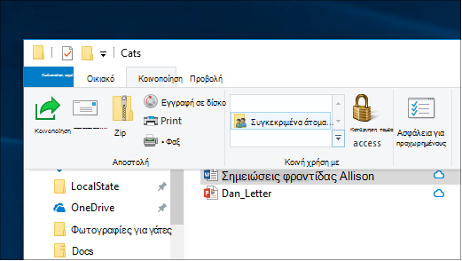
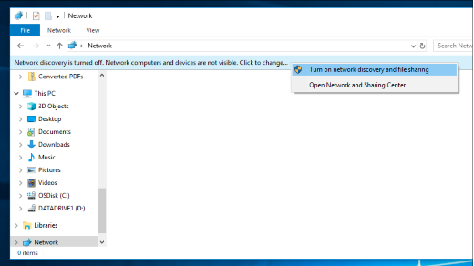

# Κοινή χρήση αρχείων μέσω δικτύου στα Windows 10

**Σημείωση**: Εάν χρησιμοποιήσατε προηγουμένως οικιακή ομάδα για κοινή χρήση αρχείων, λάβετε υπόψη ότι η οικιακή ομάδα έχει καταργηθεί από τα Windows 10 (έκδοση 1803). Τώρα, μπορείτε να κάνετε κοινή χρήση εκτυπωτών και αρχείων χρησιμοποιώντας ενσωματωμένες δυνατότητες στα Windows 10.

**Για να κάνετε κοινή χρήση αρχείων ή φακέλων μέσω δικτύου**

- Στην **Εξερεύνηση αρχείων**, επιλέξτε ένα αρχείο > κάντε κλικ στην καρτέλα **κοινή χρήση** στο επάνω μέρος > στην ενότητα **κοινή χρήση με** , κάντε κλικ στην επιλογή **συγκεκριμένα άτομα**.

    
          
- Εάν επιλέξετε πολλά αρχεία ταυτόχρονα, μπορείτε να τα μοιραστείτε όλα με τον ίδιο τρόπο. Λειτουργεί και για τους φακέλους.

**Για να δείτε τις συσκευές στο δίκτυο που κάνουν κοινή χρήση αρχείων**

- Στην **Εξερεύνηση αρχείων**, μεταβείτε στο **δίκτυο**. Εάν ο εντοπισμός δικτύου δεν είναι ενεργοποιημένος, θα δείτε ένα μήνυμα σφάλματος "ο εντοπισμός δικτύου είναι απενεργοποιημένος..."

- Κάντε κλικ στο πλαίσιο ο **Εντοπισμός δικτύου είναι απενεργοποιημένος** και, στη συνέχεια, κάντε κλικ στην επιλογή **Ενεργοποίηση εντοπισμού δικτύου και κοινής χρήσης αρχείων**.

    

[Διαβάστε περισσότερα σχετικά με την κοινή χρήση αρχείων μέσω δικτύου](https://support.microsoft.com/help/4092694/windows-10-file-sharing-over-a-network)

[Κοινή χρήση αρχείων με χρήση εφαρμογών, OneDrive, μηνυμάτων ηλεκτρονικού ταχυδρομείου και πολλά άλλα](https://support.microsoft.com/help/4027674/windows-10-share-files-in-file-explorer)
