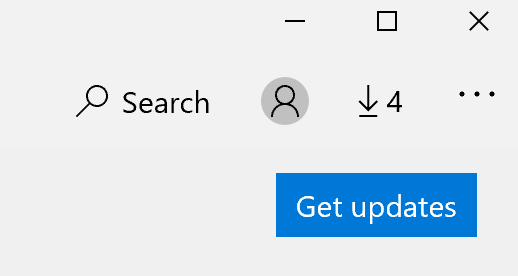

# Επιδιόρθωση της γλώσσας εμφάνισης των εφαρμογών

Αφού αλλάξετε τη γλώσσα εμφάνισης στα Windows 10, ορισμένες εφαρμογές ενδέχεται να εξακολουθούν να χρησιμοποιούν την προηγούμενη γλώσσα όταν τις ανοίγετε. Αυτό συμβαίνει επειδή πρέπει να γίνει λήψη των νέων εκδόσεων των εφαρμογών για τη γλώσσα αυτή από το Store. Για να διορθώσετε αυτό το πρόβλημα, μπορείτε είτε να περιμένετε για την αυτόματη ενημέρωση είτε να εγκαταστήσετε με μη αυτόματο τρόπο την ενημερωμένη έκδοση των εφαρμογών.

Για να εγκαταστήσετε την ενημέρωση με μη αυτόματο τρόπο, **ανοίξτε το Microsoft Store** και κάντε κλικ στην επιλογή **"Στοιχεία λήψης και ενημερώσεις"** στην επάνω δεξιά γωνία. Στη συνέχεια, κάντε **κλικ στην επιλογή "Λήψη ενημερώσεων".** Εάν η γλώσσα δεν αλλάξει μετά την ολοκλήρωση της ενημέρωσης, δοκιμάστε να επανεκκινήσετε τον υπολογιστή σας.

Για να διαβάσετε περισσότερα σχετικά με τις ρυθμίσεις γλώσσας εισόδου και εμφάνισης, ανατρέξτε στο θέμα Διαχείριση των ρυθμίσεων γλώσσας [εισόδου και εμφάνισης στα Windows 10.](https://support.microsoft.com/help/4027670/windows-10-add-and-switch-input-and-display-language-preferences)
