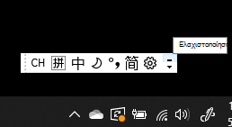
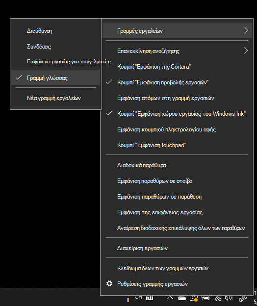
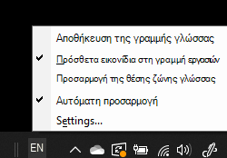

# Απόκρυψη, εμφάνιση ή επαναφορά της γραμμής γλώσσαςHide, display, or reset the language bar

**Για να ελαχιστοποιήσετε τη γραμμή γλώσσας:****To minimize the language bar:**

Μπορείτε να κάνετε κλικ στο κουμπί ελαχιστοποίησης στην επάνω δεξιά γωνία της γραμμής γλώσσας.You can click the minimize button on the top right corner of the language bar. Εναλλακτικά, μπορείτε απλώς να σύρετε τη γραμμή γλώσσας στη γραμμή εργασιών, η οποία θα την ελαχιστοποιήσει αυτόματα.Or, you can just drag the language bar to the task bar, which will automatically minimize it.

**Για να εμφανιστεί η γραμμή γλώσσας:****To pop out the language bar:**

Εάν δεν θέλετε να αγκυρώνετε τη γραμμή γλώσσας στη γραμμή εργασιών, κάντε δεξί  κλικ σε οποιονδήποτε κενό χώρο στη γραμμή εργασιών και καταργήστε την επιλογή της γραμμής γλώσσας στο μενού "Γραμμές εργαλείων".If you don't want to dock the language bar in the taskbar, right-click any empty space in the taskbar, and uncheck the **Language bar** option in the Toolbars menu. Αυτό θα κάνει τη γραμμή γλώσσας να εμφανίζεται έξω από τη γραμμή εργασιών, ακριβώς όπως στο προηγούμενο στιγμιότυπο οθόνης.This will make the language bar appear outside the taskbar, just like the previous screenshot.

**Για να επαναφέρετε την προεπιλεγμένη γραμμή γλώσσας:****To restore the language bar to default:**

Κάντε δεξί κλικ στο κουμπί γλώσσας στη γραμμή εργαλείων και κάντε κλικ στην επιλογή **"Επαναφορά της γραμμής γλώσσας"** στο μενού.Right-click the language button in the toolbar, and click **Restore the language bar** option in the menu. Αυτό θα την επαναφέρει στην προεπιλογή.This will restore it to default.

