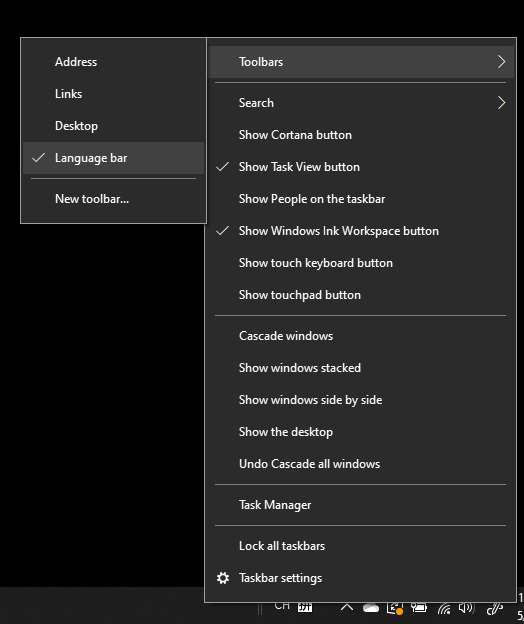

# Απόκρυψη, εμφάνιση ή επαναφορά της γραμμής γλώσσας

**Για να ελαχιστοποιήσετε τη γραμμή γλώσσας:**

Μπορείτε να κάνετε κλικ στο κουμπί ελαχιστοποίησης στην επάνω δεξιά γωνία της γραμμής γλώσσας. Εναλλακτικά, μπορείτε απλώς να σύρετε τη γραμμή γλώσσας στη γραμμή εργασιών, η οποία θα την ελαχιστοποιήσει αυτόματα.

**Για να εμφανιστεί η γραμμή γλώσσας:**

Εάν δεν θέλετε να αγκυρώνετε τη γραμμή γλώσσας στη γραμμή εργασιών, κάντε δεξί  κλικ σε οποιονδήποτε κενό χώρο στη γραμμή εργασιών και καταργήστε την επιλογή της γραμμής γλώσσας στο μενού "Γραμμές εργαλείων". Αυτό θα κάνει τη γραμμή γλώσσας να εμφανίζεται έξω από τη γραμμή εργασιών, ακριβώς όπως στο προηγούμενο στιγμιότυπο οθόνης.

**Για να επαναφέρετε την προεπιλεγμένη γραμμή γλώσσας:**

Κάντε δεξί κλικ στο κουμπί γλώσσας στη γραμμή εργαλείων και κάντε κλικ στην επιλογή **"Επαναφορά της γραμμής γλώσσας"** στο μενού. Αυτό θα την επαναφέρει στην προεπιλογή.

