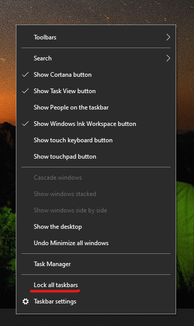

# Μετακίνηση της γραμμής εργασιών στη μία πλευρά ή στο επάνω μέρος της επιφάνειας εργασίας

Αρχικά, επιβεβαιώστε ότι η γραμμή εργασιών είναι ξεκλειδωμένη. Για να μάθετε εάν η δική σας είναι ξεκλείδωτη, κάντε δεξί κλικ σε οποιοδήποτε κενό σημείο της γραμμής εργασιών και δείτε εάν το **Κλείδωμα της γραμμής εργασιών** είναι τσεκαρισμένο. Εάν υπάρχει σημάδι ελέγχου, η γραμμή εργασιών είναι κλειδωμένη και δεν είναι δυνατή η μετακίνησή της. Κάνοντας κλικ μία φορά στην επιλογή **Κλείδωμα της γραμμής εργασιών**, θα την ξεκλειδώσετε και θα καταργήσετε το σημάδι ελέγχου.

Εάν έχετε πολλές οθόνες που εμφανίζουν τη γραμμή εργασιών, θα βλέπετε το μήνυμα **Κλείδωμα όλων των γραμμών εργασιών**.

Μόλις ξεκλειδωθεί η γραμμή εργασιών, μπορείτε να πατήσετε παρατεταμένα οποιοδήποτε κενό σημείο στη γραμμή εργασιών και να την σύρετε στη θέση που θέλετε στην οθόνη. Μπορείτε επίσης να το κάνετε κάνοντας δεξί κλικ σε οποιοδήποτε κενό σημείο στη γραμμή εργασιών και να μεταβείτε στις **[Ρυθμίσεις της γραμμής εργασιών](ms-settings:taskbar?activationSource=GetHelp) > Θέση γραμμής εργασιών στην οθόνη**.
