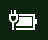

# Το εικονίδιο τροφοδοσίας ή μπαταρίας λείπει από Windows 10

Εάν η Windows 10 σας διαθέτει μπαταρία (π.χ. φορητό υπολογιστή ή tablet ή υπολογιστή συνδεδεμένο μέσω USB σε UPS), συνήθως εμφανίζεται ένα εικονίδιο τροφοδοσίας/μπαταρίας στη γραμμή εργασιών κοντά στο ρολόι, για παράδειγμα:

Εάν δεν βλέπετε αυτό το εικονίδιο, μπορεί να είναι κρυφό:

1. Μεταβείτε **[στην Ρυθμίσεις > εξατομίκευσης > γραμμή εργασιών.](ms-settings:taskbar?activationSource=GetHelp)**

2. Στην περιοχή "Ειδοποιήσεις", κάντε κλικ **στην επιλογή "Επιλογή των εικονιδίων που εμφανίζονται στη γραμμή εργασιών".**

3. Στη συνέχεια, βρείτε **το στοιχείο Power** στη λίστα και αλλάξτε τη ρύθμιση σε **"Ενεργοποίηση".**

    

**Αντιμετώπιση προβλημάτων**

Εάν ακολουθήσατε τις παραπάνω  οδηγίες και ο διακόπτης τροφοδοσίας είναι γκριζαρισμένος ή δεν είναι ορατός, στο πλαίσιο αναζήτησης στη γραμμή εργασιών, πληκτρολογήστε **διαχείριση** συσκευών και, στη συνέχεια, επιλέξτε **"Διαχείριση** συσκευών" στη λίστα των αποτελεσμάτων. Στην **περιοχή "Μπαταρίες",** κάντε δεξί κλικ στην μπαταρία για τη συσκευή σας, κάντε κλικ στην επιλογή "Απενεργοποίηση" και κάντε κλικ στην επιλογή **"Ναι".**  Περιμένετε μερικά δευτερόλεπτα και, στη συνέχεια, κάντε δεξί κλικ στην μπαταρία και κάντε κλικ στην επιλογή **"Ενεργοποίηση".** Στη συνέχεια, επανεκκινήστε τη συσκευή σας.

Εάν ακολουθήσατε τις παραπάνω οδηγίες, αλλά το εικονίδιο μπαταρίας δεν εμφανίζεται στη γραμμή εργασιών, στο πλαίσιο αναζήτησης στη γραμμή εργασιών, πληκτρολογήστε **διαχείριση** εργασιών και, στη συνέχεια, κάντε κλικ στην επιλογή **"Διαχείριση** εργασιών" στη λίστα των αποτελεσμάτων. Στην καρτέλα **"Διεργασίες",** στην περιοχή **"Όνομα",** κάντε δεξί κλικ στην **Εξερεύνηση και, στη** συνέχεια, κάντε κλικ στην **επιλογή "Επανεκκίνηση".**
