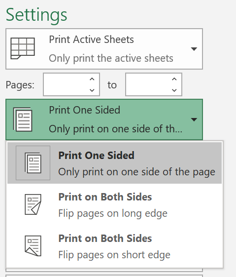
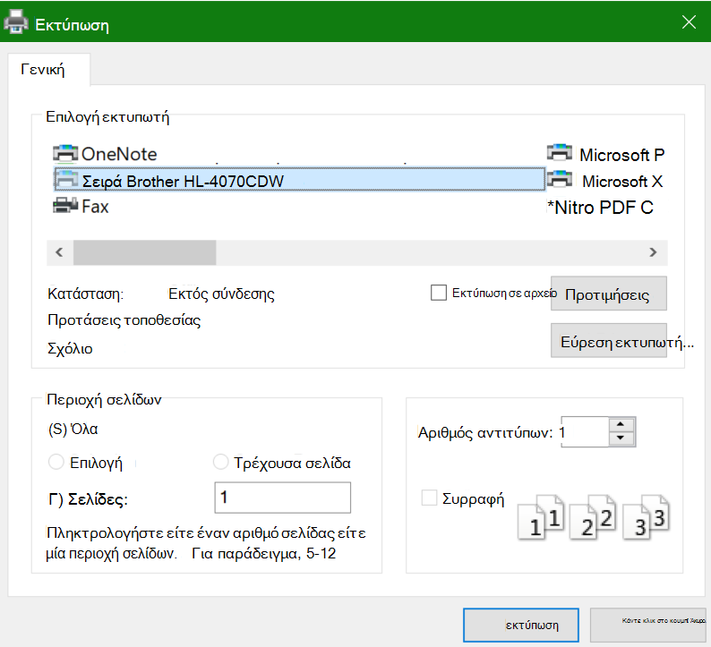

# Εκτύπωση και στις δύο πλευρές του χαρτιού (εκτύπωση διπλής όψης)

**Ο εκτυπωτής μου μπορεί να εκτυπώσει διπλής όψης;**

Η σύνοψη δυνατοτήτων ή το εγχειρίδιο του εκτυπωτή σας θα πρέπει να σας ενημερώσουν εάν έχει δυνατότητα εκτύπωσης και στις δύο πλευρές του χαρτιού, γνωστές και ως "εκτύπωση διπλής όψης". Εάν έχετε το Microsoft Office, ένας άλλος τρόπος για να το μάθετε είναι να ανοίξετε μια εφαρμογή του Office, όπως το Word ή το Excel, να επιλέξετε "Αρχείο **> Εκτύπωση",** να βεβαιωθείτε ότι είναι επιλεγμένος ο σωστός εκτυπωτής και να αναζητάτε τη δυνατότητα στην ενότητα "Ρυθμίσεις". Για παράδειγμα: 

**Εκτύπωση διπλής όψης στο Microsoft Office**

Εάν ο εκτυπωτής σας έχει τη δυνατότητα εκτύπωσης και στις δύο πλευρές, όταν μεταβείτε στην επιλογή "Αρχείο **> Εκτύπωση"** στην εφαρμογή του Office, θα δείτε μια επιλογή "Εκτύπωση και στις δύο πλευρές", όπως φαίνεται στο παραπάνω παράδειγμα.  Επιλέξτε τον τύπο εκτύπωσης διπλής όψης που θέλετε (αναστροφή στη μεγάλη ακμή ή αναστροφή στη μικρή ακμή) και κάντε κλικ στην επιλογή "Εκτύπωση" **για** να ξεκινήσετε την εκτύπωση.

**Εκτύπωση διπλής όψης από οποιαδήποτε εφαρμογή**

Σε πολλές εφαρμογές κατά την εκτύπωση, θα δείτε ένα γενικό παράθυρο διαλόγου εκτύπωσης που μοιάζει κάπως έτσι: 

Βεβαιωθείτε ότι είναι επιλεγμένος ο σωστός εκτυπωτής και, στη συνέχεια, **κάντε κλικ** στην επιλογή "Προτιμήσεις" για να ανοίξετε το παράθυρο προτιμήσεων εκτυπωτή. Εάν ο εκτυπωτής έχει δυνατότητα εκτύπωσης διπλής όψης, η δυνατότητα ενεργοποίησης αυτής της δυνατότητας για την τρέχουσα εργασία εκτύπωσης θα εμφανίζεται σε αυτό το παράθυρο.
