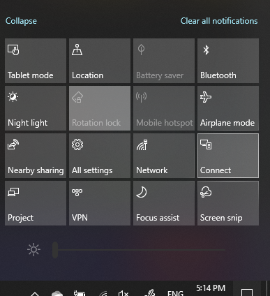

# Έργο σε PCProject to a PC

Στη συσκευή προορισμού σας (προβολή σε), αναζητήστε τη φράση "ρυθμίσεις προβολής" για να ανοίξετε τη σελίδα ρυθμίσεων της **προβολής σε αυτόν τον υπολογιστή**.On your destination device (projecting to), search for "Projection Settings" to open the Settings page of **Projecting to this PC**. Στη συνέχεια, βεβαιωθείτε ότι:Then make sure that:
- "Ορισμένα παράθυρα και συσκευές Android μπορούν να προβάλλουν αυτόν τον υπολογιστή όταν λέτε ότι είναι OK", το αναπτυσσόμενο μενού έχει τεθεί σε " **πάντα απενεργοποιημένο**"."Some Windows and Android devices can project to this PC when you say it's OK" drop-down menu is set to **Always Off**.
- Το αναπτυσσόμενο μενού "Ζητήστε την εργασία σε αυτόν τον υπολογιστή" έχει καθοριστεί σε **κάθε φορά που απαιτείται σύνδεση**."Ask to project to this PC" drop-down menu is set to **Every time a connection is required**.
- Το αναπτυσσόμενο μενού "απαίτηση PIN για σύζευξη" έχει την τιμή " **ποτέ**"."Require PIN for pairing" drop-down menu is set to **Never**.

Στη συσκευή προορισμού σας, ξεκινήστε την εφαρμογή **Connect** , μεταβαίνοντας στην **Έναρξη** και αναζητήστε τη λέξη "σύνδεση".On your destination device, launch **Connect** app by going to **Start** and search for "Connect".

Στη συνέχεια, στη συσκευή προέλευσης από την οποία προσπαθείτε να κάνετε προβολή:Then, on your source device that you are trying to project from:

1. Πατήστε το **πλήκτρο των Windows + A** για να ανοίξετε το κέντρο ενεργειών.Press **Windows key + A** to open Action Center.
2. Κάντε κλικ στην επιλογή **σύνδεση**.Click **Connect**.
3. Κάντε κλικ στη συσκευή στην οποία θέλετε να προβάλετε την οθόνη.Click the device you want to project the screen to.

Μετά τα παραπάνω βήματα, η συσκευή προορισμού σας θα πρέπει να εμφανίζει την οθόνη της συσκευής προέλευσης σαν να είναι δευτερεύουσα οθόνη.After the above steps, your destination device should display the screen of the source device as if it is a secondary monitor.
