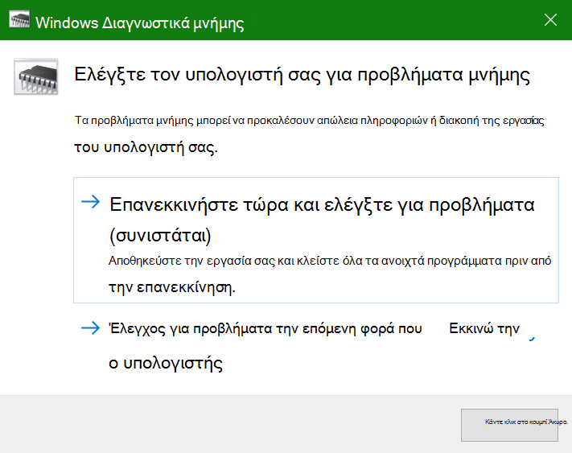

# Εκτέλεση Windows διαγνωστικών μνήμης σε Windows 10

Εάν Windows και οι εφαρμογές στον υπολογιστή σας παρουσιάζει σφάλμα, παγώνουν ή ενεργούν με ασταθή τρόπο, ενδέχεται να έχετε πρόβλημα με τη μνήμη του υπολογιστή (RAM). Μπορείτε να εκτελέσετε το Windows μνήμης για να ελέγξετε για προβλήματα με τη μνήμη RAM του υπολογιστή.

Στο πλαίσιο αναζήτησης στη γραμμή εργασιών, πληκτρολογήστε διαγνωστικά **μνήμης και,** στη συνέχεια, **επιλέξτε Windows Διαγνωστικά μνήμης.** 

Για να εκτελέσετε τα διαγνωστικά, ο υπολογιστής πρέπει να επανεκκινήσει. Έχετε την επιλογή να κάνετε επανεκκίνηση αμέσως (αποθηκεύστε πρώτα την εργασία σας και κλείστε τα ανοιχτά έγγραφα και μηνύματα ηλεκτρονικού ταχυδρομείου) ή προγραμματίστε την αυτόματη εκτέλεση του διαγνωστικού ελέγχου την επόμενη φορά που θα επανεκκινήσει ο υπολογιστής:

Όταν γίνει επανεκκίνηση του υπολογιστή, το **Windows διαγνωστικών μνήμης** θα εκτελείται αυτόματα. Η κατάσταση και η πρόοδος θα εμφανίζονται κατά την εκτέλεση των διαγνωστικών και έχετε την επιλογή να ακυρώσετε τα διαγνωστικά, κάνοντας κλικ στο **πλήκτρο ESC** στο πληκτρολόγιό σας.

Όταν ολοκληρωθεί ο διαγνωστικός έλεγχος, Windows ξεκινήσει κανονικά.
Αμέσως μετά την επανεκκίνηση, όταν εμφανιστεί η επιφάνεια  εργασίας, θα εμφανιστεί μια ειδοποίηση (δίπλα στο εικονίδιο του Κέντρου ενεργειών στη γραμμή εργασιών), για να υποδείξει εάν βρέθηκαν σφάλματα μνήμης. Για παράδειγμα:

Ακολουθεί το εικονίδιο του Κέντρου ενεργειών:  

Και ένα δείγμα ειδοποίησης: 

Εάν χάσατε την ειδοποίηση,  μπορείτε να επιλέξετε το εικονίδιο του Κέντρου ενεργειών στη γραμμή εργασιών για να εμφανίσετε το Κέντρο **ενεργειών** και να δείτε μια λίστα ειδοποιήσεων με δυνατότητα κύλισης.

Για να εξετάσετε λεπτομερείς πληροφορίες, **πληκτρολογήστε το** συμβάν στο πλαίσιο αναζήτησης στη γραμμή εργασιών και, στη συνέχεια, επιλέξτε "Πρόγραμμα **προβολής συμβάντων".** Στο αριστερό **τμήμα παραθύρου του** Προγράμματος προβολής συμβάντων, μεταβείτε στο Windows αρχείων > **Συστήματος.** Στο δεξιό τμήμα παραθύρου, σαρώστε προς τα  κάτω στη λίστα ενώ βλέπετε τη στήλη "Προέλευση", μέχρι να δείτε συμβάντα με την τιμή **προέλευσης MemoryDiagnostics-Results.** Επισημάνετε κάθε τέτοιο συμβάν και δείτε τις πληροφορίες αποτελέσματος στο πλαίσιο κάτω από την **καρτέλα "Γενικά"** κάτω από τη λίστα.
