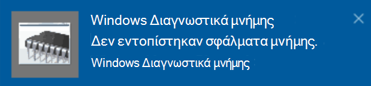

# Εκτέλεση διαγνωστικών μνήμης των Windows στα Windows 10Run Windows Memory Diagnostics in Windows 10

Εάν τα Windows και οι εφαρμογές στον υπολογιστή σας παρουσιάζει σφάλμα, παγώνουν ή ενεργούν με ασταθή τρόπο, ενδέχεται να έχετε πρόβλημα με τη μνήμη του υπολογιστή (RAM).If Windows and apps on your PC are crashing, freezing, or acting in an unstable manner, you may have a problem with the PC’s memory (RAM). Μπορείτε να εκτελέσετε το Διαγνωστικό μνήμης των Windows για να ελέγξετε για προβλήματα με τη μνήμη RAM του υπολογιστή.You can run the Windows Memory Diagnostic to check for problems with the PC’s RAM.

Στο πλαίσιο αναζήτησης στη γραμμή εργασιών, πληκτρολογήστε διαγνωστικά **μνήμης και,** στη συνέχεια, επιλέξτε **Διαγνωστικά μνήμης των Windows.**In the search box on your taskbar, type **memory diagnostic**, and then select **Windows Memory Diagnostic**. 

Για να εκτελέσετε τα διαγνωστικά, ο υπολογιστής πρέπει να επανεκκινήσει.To run the diagnostic, the PC needs to restart. Έχετε την επιλογή να κάνετε επανεκκίνηση αμέσως (αποθηκεύστε πρώτα την εργασία σας και κλείστε τα ανοιχτά έγγραφα και μηνύματα ηλεκτρονικού ταχυδρομείου) ή προγραμματίστε την αυτόματη εκτέλεση του διαγνωστικού ελέγχου την επόμενη φορά που θα επανεκκινήσει ο υπολογιστής:You have the option to restart immediately (please save your work and close open documents and e-mails first), or schedule the diagnostic to run automatically the next time the PC restarts:

Όταν γίνει επανεκκίνηση του υπολογιστή, το Εργαλείο **διαγνωστικών μνήμης των Windows** θα εκτελείται αυτόματα.When the PC restarts, the **Windows Memory Diagnostics Tool** will run automatically. Η κατάσταση και η πρόοδος θα εμφανίζονται κατά την εκτέλεση των διαγνωστικών και έχετε την επιλογή να ακυρώσετε τα διαγνωστικά, κάνοντας κλικ στο **πλήκτρο ESC** στο πληκτρολόγιό σας.Status and progress will be displayed as the diagnostics run, and you have the option of cancelling the diagnostics by hitting the **ESC** key on your keyboard.

Όταν ολοκληρωθεί ο διαγνωστικός έλεγχος, τα Windows θα ξεκινήσουν κανονικά.When the diagnostics are complete, Windows will start normally.
Αμέσως μετά την επανεκκίνηση, όταν εμφανιστεί η επιφάνεια  εργασίας, θα εμφανιστεί μια ειδοποίηση (δίπλα στο εικονίδιο του Κέντρου ενεργειών στη γραμμή εργασιών), για να υποδείξει εάν βρέθηκαν σφάλματα μνήμης.Immediately after restart, when the Desktop appears, a notification will appear (next to the **Action Center** icon on the taskbar), to indicate whether any memory errors were found. Για παράδειγμα:For example:

Ακολουθεί το εικονίδιο του Κέντρου ενεργειών:Here's the Action Center icon:  

Και ένα δείγμα ειδοποίησης:And a sample notification: 

Εάν χάσατε την ειδοποίηση,  μπορείτε να επιλέξετε το εικονίδιο του Κέντρου ενεργειών στη γραμμή εργασιών για να εμφανίσετε το Κέντρο **ενεργειών** και να δείτε μια λίστα ειδοποιήσεων με δυνατότητα κύλισης.If you missed the notification, you can select the **Action Center** icon  on the taskbar to display the **Action Center** and see a scrollable list of notifications.

Για να εξετάσετε λεπτομερείς πληροφορίες, **πληκτρολογήστε το** συμβάν στο πλαίσιο αναζήτησης στη γραμμή εργασιών και, στη συνέχεια, επιλέξτε "Πρόγραμμα **προβολής συμβάντων".**To review detailed information, type **event** into the search box on your taskbar, and then select **Event Viewer**. Στο αριστερό **τμήμα παραθύρου του** Προγράμματος προβολής συμβάντων, μεταβείτε στην επιλογή **"Αρχεία καταγραφής των Windows > Συστήματος".**In the **Event Viewer**’s left-hand pane, navigate to **Windows Logs > System**. Στο δεξιό τμήμα παραθύρου, σαρώστε προς τα  κάτω στη λίστα ενώ βλέπετε τη στήλη "Προέλευση", μέχρι να δείτε συμβάντα με την τιμή **προέλευσης MemoryDiagnostics-Results.**In the right-hand pane, scan down the list while looking at the **Source** column, until you see events with Source value **MemoryDiagnostics-Results**. Επισημάνετε κάθε τέτοιο συμβάν και δείτε τις πληροφορίες αποτελέσματος στο πλαίσιο κάτω από την **καρτέλα "Γενικά"** κάτω από τη λίστα.Highlight each such event and see the result information in the box under the **General** tab below the list.
