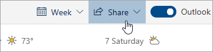

# Κοινή χρήση με το Outlook στο web

Από το Ημερολόγιό σας, στη γραμμή εργαλείων στο επάνω μέρος της σελίδας, επιλέξτε **Κοινή χρήση**και επιλέξτε το ημερολόγιο που θέλετε να μοιραστείτε.

    

**Σημείωση**: Δεν μπορείτε να κάνετε κοινή χρήση ημερολογίων που ανήκουν σε άλλα άτομα.

- Πληκτρολογήστε το όνομα ή τη διεύθυνση ηλεκτρονικού ταχυδρομείου του ατόμου με το οποίο θέλετε να κάνετε κοινή χρήση του ημερολογίου σας.
- Επιλέξτε τον τρόπο με τον οποίο θέλετε να χρησιμοποιεί το άτομο το ημερολόγιό σας:
    - **Δυνατότητα προβολής όταν είμαι απασχολημένος**   Τους επιτρέπει να βλέπουν πότε είστε απασχολημένοι, αλλά δεν περιλαμβάνει λεπτομέρειες όπως η τοποθεσία της εκδήλωσης.
    - **Δυνατότητα προβολής τίτλων και τοποθεσιών**   Τους επιτρέπει να βλέπουν πότε είστε απασχολημένοι, καθώς και τον τίτλο και την τοποθεσία των συμβάντων.
    - **Δυνατότητα προβολής όλων των λεπτομερειών**   τους επιτρέπει να βλέπουν όλες τις λεπτομέρειες των γεγονότων σας.
    - **Δυνατότητα επεξεργασίας**   τους επιτρέπει να επεξεργάζονται το ημερολόγιό σας.
    - **Πληρεξούσιος**   Τους επιτρέπει να επεξεργάζονται το ημερολόγιό σας και να το μοιράζονται με άλλους.
- Επιλέξτε **Κοινή χρήση**.
