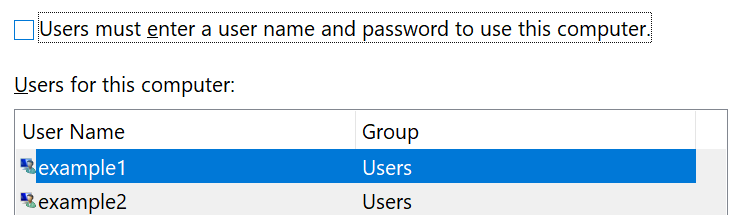

# Είσοδος σε Windows 10 χωρίς χρήση κωδικού πρόσβασης

Για να αποφύγετε την πληκτρολόγηση κωδικού πρόσβασης κατά την εκκίνηση του Windows, συνιστάται να χρησιμοποιήσετε μία από τις επιλογές ασφαλούς σύνδεσης του Windows Hello, όπως PIN, αναγνώριση προσώπου ή δακτυλικό αποτύπωμα, εάν είναι διαθέσιμη. Εάν θέλετε πραγματικά να απενεργοποιήσετε την ασφαλή είσοδο, ανατρέξτε στις οδηγίες "Αυτόματη είσοδος Windows 10" παρακάτω.

**Ασφαλής Windows Hello εναλλακτικές λύσεις για τον κωδικό πρόσβασης του λογαριασμού**

Μεταβείτε **στην Ρυθμίσεις > λογαριασμών > επιλογές είσοδος** (ή κάντε κλικ [εδώ).](ms-settings:signinoptions?activationSource=GetHelp) Θα εμφανίζονται οι διαθέσιμες επιλογές είσοδος. Για παράδειγμα:

Κάντε κλικ ή πατήστε μία από τις επιλογές για να ρυθμίσετε τις παραμέτρους της. Την επόμενη φορά που θα ξεκινήσετε ή Windows, θα μπορείτε να χρησιμοποιήσετε τη νέα επιλογή αντί για κωδικό πρόσβασης. 

**Αυτόματη είσοδος σε Windows 10**

**Σημείωση:** Η αυτόματη είσοδος είναι εύκολη, αλλά παρουσιάζει κίνδυνο ασφαλείας, ειδικά εάν ο υπολογιστής σας είναι προσβάσιμος από πολλά άτομα. 

1. Κάντε κλικ ή πατήστε **το κουμπί "Έναρξη"** στη γραμμή εργασιών.

2. Πληκτρολογήστε **netplwiz και πατήστε** το πλήκτρο Enter για να ανοίξετε το παράθυρο "Λογαριασμοί χρηστών".

3. Στους **λογαριασμούς χρηστών,** κάντε κλικ στο λογαριασμό στον οποίο θέλετε να πραγματοποιείτε αυτόματη είσοδο Windows ξεκινά.

4. Καταργήστε την επιλογή του πλαισίου ελέγχου "Οι χρήστες πρέπει να καταχωρήσουν ένα όνομα χρήστη και έναν κωδικό πρόσβασης για να χρησιμοποιήσουν αυτόν τον υπολογιστή".

    

5. Κάντε κλικ στο κουμπί **OK**. Θα σας ζητηθεί να εισαγάγετε και να επιβεβαιώσετε τον κωδικό πρόσβασης για το λογαριασμό που επιλέξατε. Κάντε κλικ **στο κουμπί OK** για να ολοκληρώσετε. Την επόμενη Windows 10, θα εισέλθετε αυτόματα στο λογαριασμό που επιλέξατε.
