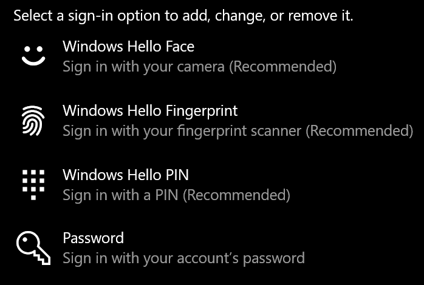
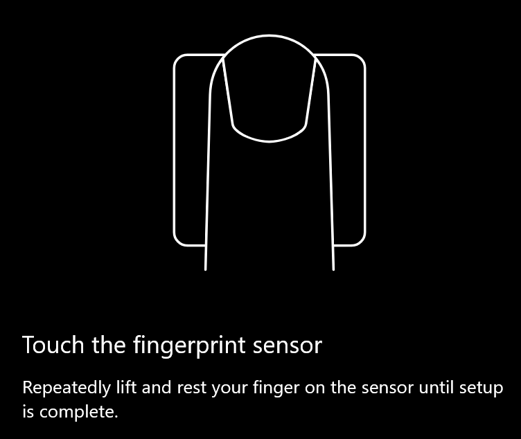
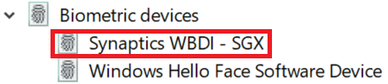

# Επιλογή ξεκλειδώματος δακτυλικών αποτυπωμάτων στα Windows 10

**Ενεργοποίηση δακτυλικού αποτυπώματος του Windows Hello**

Για να ξεκλειδώσετε τα Windows 10 χρησιμοποιώντας το δακτυλικό σας αποτύπωμα, πρέπει να ρυθμίσετε το Windows Hello Fingerprint προσθέτοντας (αφήνοντας τα Windows να μάθουν να αναγνωρίζουν) τουλάχιστον ένα δάχτυλο. 

1. Μεταβείτε **στις ρυθμίσεις > λογαριασμών > επιλογές σύνδεσης** (ή κάντε κλικ [εδώ).](ms-settings:signinoptions?activationSource=GetHelp) Θα εμφανίζονται οι διαθέσιμες επιλογές είσοδος. Για παράδειγμα:

    

2. Κάντε κλικ ή πατήστε **το Δακτυλικό αποτύπωμα του Windows Hello** και, στη συνέχεια, κάντε κλικ στην επιλογή **"Ρύθμιση".** Στο παράθυρο ρύθμισης του Windows Hello, κάντε κλικ στην **επιλογή "Γρήγορα αποτελέσματα".** Ο αισθητήρας δακτυλικών αποτυπωμάτων θα ενεργοποιηθεί και θα σας ζητηθεί να τοποθετήσετε το δάχτυλό σας στον αισθητήρα:

   

3. Ακολουθήστε τις οδηγίες, οι οποίες θα σας ζητήσουν να σαρώσετε επανειλημμένα το δάχτυλό σας. Όταν ολοκληρωθεί αυτή η διαδικασία, θα έχετε την επιλογή να προσθέσετε άλλα δάχτυλα που μπορεί να θέλετε να χρησιμοποιήσετε για είσοδο. Την επόμενη φορά που θα εισέλθετε στα Windows 10, θα έχετε την επιλογή να χρησιμοποιήσετε το δακτυλικό σας αποτύπωμα για να το κάνετε αυτό.

**Το δακτυλικό αποτύπωμα του Windows Hello δεν είναι διαθέσιμο ως επιλογή για είσοδο**

Εάν το Δακτυλικό αποτύπωμα του Windows Hello δεν εμφανίζεται ως επιλογή στις επιλογές **εισόδου,** αυτό σημαίνει ότι τα Windows δεν γνωρίζουν κανένα πρόγραμμα ανάγνωσης δακτυλικών αποτυπωμάτων/σαρωτή συνδεδεμένο στον υπολογιστή σας ή ότι μια πολιτική συστήματος εμποδίζει τη χρήση του (εάν, για παράδειγμα, η διαχείριση του υπολογιστή σας γίνεται από το χώρο εργασίας σας). Για αντιμετώπιση προβλημάτων: 

1. Επιλέξτε το κουμπί **"Έναρξη"** στη γραμμή εργασιών και αναζητήστε τη **Διαχείριση συσκευών.**

2. Κάντε κλικ ή πατήστε για να ανοίξετε **τη Διαχείριση συσκευών.**

3. Στη Διαχείριση συσκευών, αναπτύξτε τις βιομετρικές συσκευές κάνοντας κλικ στα chevron της.

   

4. Ο σαρωτής δακτυλικών αποτυπωμάτων θα πρέπει να εμφανίζεται ως βιομετρική συσκευή, όπως ο σαρωτής Synaptics WBDI:

   

5. Εάν ο σαρωτής δακτυλικών αποτυπωμάτων δεν εμφανίζεται και ο σαρωτής είναι ενσωματωμένος στον υπολογιστή σας, μεταβείτε στην τοποθεσία Web του κατασκευαστή του υπολογιστή. Στην ενότητα τεχνικής υποστήριξης για το μοντέλο του υπολογιστή σας, αναζητήστε ένα πρόγραμμα οδήγησης των Windows 10 για σαρωτή που μπορείτε να εγκαταστήσετε.

6. Εάν ο σαρωτής είναι ξεχωριστός από τον υπολογιστή (συνδεδεμένος μέσω USB), μεταβείτε στην τοποθεσία Web του κατασκευαστή του σαρωτή για να βρείτε και να εγκαταστήσετε λογισμικό προγράμματος οδήγησης συσκευής Windows 10 για το μοντέλο σαρωτή που έχετε.
