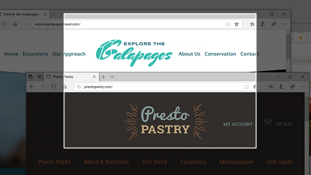
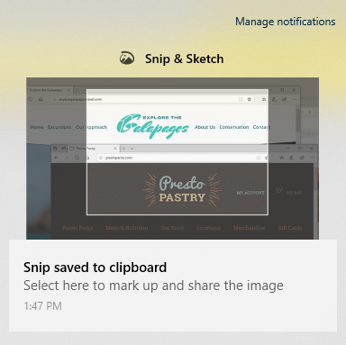

# Χρήση του αποκόμματος & σκίτσο για την καταγραφή, τη σήμανση και την κοινή χρήση εικόνων

Το σκίτσο οθόνης ονομάζεται τώρα **απόκομμα & σκίτσο**. **Για να κάνετε γρήγορα ένα απόκομμα**:

1. Πατήστε το **πλήκτρο με το λογότυπο των Windows + SHIFT + S**. Θα δείτε την οθόνη σας να σκουραίνει και ο δρομέας να εμφανίζεται ως Σταυρός. 

2. Επιλέξτε ένα σημείο στο άκρο της περιοχής που θέλετε να αντιγράψετε και κάντε αριστερό κλικ στο δρομέα. 

3. Μετακινήστε το δρομέα για να επισημάνετε την περιοχή που θέλετε να καταγράψετε. Η περιοχή που καταγράφετε θα εμφανίζεται στην οθόνη σας.

   

Η εικόνα που αποκοπεί είναι αποθηκευμένη στο Πρόχειρο, έτοιμη για επικόλληση σε ένα μήνυμα ηλεκτρονικού ταχυδρομείου ή έγγραφο. 

**Εάν θέλετε να επεξεργαστείτε ή να προβάλετε την εικόνα**: 

- Κάντε κλικ στο εικονίδιο ειδοποιήσεων στο δεξιό άκρο της γραμμής εργασιών. στη συνέχεια, κάντε κλικ στην εικόνα που μόλις έχετε συλλάβει. Το απόκομμα ανοίγει στην εφαρμογή αποκομμάτων & σκίτσο.

   
