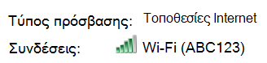
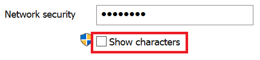

# Προβολή κωδικού πρόσβασης δικτύου Wi-Fi στα Windows 10View Wi-Fi network password in Windows 10

1. Βεβαιωθείτε ότι ο υπολογιστής με Windows 10 είναι συνδεδεμένος στο δίκτυο Wi-Fi.Make sure your Windows 10 PC is connected to the Wi-Fi network.

2. Μεταβείτε **στις Ρυθμίσεις > Δίκτυο & κατάσταση > Internet**ή κάντε κλικ ή πατήστε [εδώ](ms-settings:network?activationSource=GetHelp) για να μας αφήσετε να σας μεταφέρει εκεί τώρα.)Go to **Settings  > Network & Internet  > Status**, or click or tap [here](ms-settings:network?activationSource=GetHelp) to let us take you there now.)

3. Κάντε κλικ στην επιλογή **Κέντρο δικτύου και κοινής χρήσης**.Click **Network and Sharing Center**.

    

4. Στο **Κέντρο δικτύου και κοινής χρήσης**, δίπλα στις **Συνδέσεις**, θα δείτε το όνομα του ασύρματου δικτύου σας.In **Network and Sharing Center**, next to **Connections**, you will see the name of your wireless network. Για παράδειγμα, εάν το δίκτυό σας ονομάζεται "ABC123", μπορεί να δείτε:For example, if your network is named "ABC123," you might see:

    

    Κάντε κλικ στο όνομα του ασύρματου δικτύου για να ανοίξετε το παράθυρο Κατάσταση Wi-Fi.Click the wireless network name to open the Wi-Fi Status window. 

5. Στο παράθυρο Κατάσταση Wi-Fi, κάντε κλικ στην επιλογή **Ασύρματες ιδιότητες**, κάντε κλικ στην καρτέλα **Ασφάλεια** και επιλέξτε **Εμφάνιση χαρακτήρων**.In the Wi-Fi Status window, click **Wireless Properties**, click the **Security** tab, and check **Show characters**.

    

