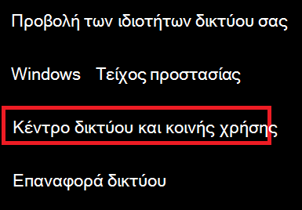

# Προβολή κωδικού πρόσβασης δικτύου Wi-Fi στα Windows 10

1. Βεβαιωθείτε ότι ο υπολογιστής με Windows 10 είναι συνδεδεμένος στο δίκτυο Wi-Fi.

2. Μεταβείτε **στις Ρυθμίσεις > Δίκτυο & κατάσταση > Internet**ή κάντε κλικ ή πατήστε [εδώ](ms-settings:network?activationSource=GetHelp) για να μας αφήσετε να σας μεταφέρει εκεί τώρα.)

3. Κάντε κλικ στην επιλογή **Κέντρο δικτύου και κοινής χρήσης**.

    

4. Στο **Κέντρο δικτύου και κοινής χρήσης**, δίπλα στις **Συνδέσεις**, θα δείτε το όνομα του ασύρματου δικτύου σας. Για παράδειγμα, εάν το δίκτυό σας ονομάζεται "ABC123", μπορεί να δείτε:

    

    Κάντε κλικ στο όνομα του ασύρματου δικτύου για να ανοίξετε το παράθυρο Κατάσταση Wi-Fi. 

5. Στο παράθυρο Κατάσταση Wi-Fi, κάντε κλικ στην επιλογή **Ασύρματες ιδιότητες**, κάντε κλικ στην καρτέλα **Ασφάλεια** και επιλέξτε **Εμφάνιση χαρακτήρων**.

    

